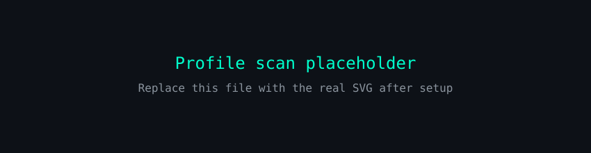

<!--
  ┌───────────────────────────────────────────────────────────────┐
  │  👨‍💻 YOGESH KUMAR — GitHub Profile README (Reel Style)        │
  │                                                               │
  │  This file lives in the special repository:                   │
  │      https://github.com/Yogesh2201/Yogesh2201                 │
  │                                                               │
  │  ✏️  How to personalise:                                      │
  │   1. Search for "TODO" in this file and replace placeholders. │
  │   2. Put your real LinkedIn / email / Kaggle links in the     │
  │      "Connect" section.                                       │
  │   3. Point the Featured Projects to your real repositories.   │
  │   4. The stats cards, activity graph, view counter and        │
  │      contribution snake update automatically.                 │
  └───────────────────────────────────────────────────────────────┘
-->

# 👨‍💻 YOGESH KUMAR

### 🧠 Data Science & AI/ML Researcher

**Python • Statistics • Machine Learning • Financial Analysis**

  

  
  
  

---

## 🖥️ Profile Scan

  

---

## 👤 About Me

<table>
<tr>

<td width="55%" valign="top">

### 👋 Hello, I'm Yogesh!

I'm a **Data Science & AI/ML Researcher** currently learning and building
projects around **Python, statistics, machine learning and financial
analysis**.

- 🔭 Currently working on data-driven research projects
- 🌱 Deep-diving into **Machine Learning & Statistics**
- 👯 Open to collaborating on **Data Science / AI-ML** projects
- 💬 Ask me about **Python, ML, Statistics, Finance & Data**
- ⚡ Fun fact: I can find insights in almost any dataset 📊

</td>

<td width="45%" valign="top">

### ⚡ Quick Stats

<!-- 🚀 Auto-updates via GitHub API -->

### 🎯 Current Focus

🐍 Python &nbsp;•&nbsp; 📊 Statistics &nbsp;•&nbsp; 🤖 Machine Learning &nbsp;•&nbsp; 📈 Financial Analysis &nbsp;•&nbsp; 💻 DSA

</td>

</tr>
</table>

---

## 📊 Stats Dashboard

  
  
  
  

<table>
<tr>

<td align="center" width="50%">
  
</td>

<td align="center" width="50%">
  
</td>

</tr>
</table>

  

---

## 📈 Contribution Activity

  

---

## 🧠 Currently Learning

<table>
<tr>
<td align="center">🐍 Python</td>
<td align="center">📊 Statistics</td>
<td align="center">🤖 Machine Learning</td>
</tr>
<tr>
<td align="center">🧮 Probability</td>
<td align="center">📈 Financial Analysis</td>
<td align="center">💻 Data Structures &amp; Algorithms</td>
</tr>
</table>

---

## 🛠️ Tech Stack

  

  <b>Languages:</b> Python, SQL &nbsp;&nbsp;•&nbsp;&nbsp; <b>ML / DS:</b> Pandas, NumPy, Scikit-learn, TensorFlow, PyTorch, Matplotlib &nbsp;&nbsp;•&nbsp;&nbsp; <b>Tools:</b> Jupyter, Git, GitHub, VS Code

---

## 🚀 Featured Projects

<table>
<tr>

<td width="33%" align="center" valign="top">

### 📊 Stock Research System

Financial research system for analyzing:

- Revenue growth
- Profitability
- Valuation & DCF
- Financial red flags

**Tech:** `Python` `Pandas` `APIs` `Data Analysis`

  <a href="https://github.com/Yogesh2201/stock-research-system"><!-- TODO: replace with your repo URL -->
    
  </a>

</td>

<td width="33%" align="center" valign="top">

### 🤖 AI Research Assistant

An AI-powered research workflow for collecting, processing and analyzing information.

- Automated data gathering
- LLM-powered analysis
- Insight summaries

**Tech:** `Python` `APIs` `LLMs`

  <a href="https://github.com/Yogesh2201/ai-research-assistant"><!-- TODO: replace with your repo URL -->
    
  </a>

</td>

<td width="33%" align="center" valign="top">

### 🧠 Data Science & ML Portfolio

A growing collection of Data Science & Machine Learning projects, notebooks and experiments.

- Exploratory data analysis
- Model building & evaluation
- Real-world datasets

**Tech:** `Python` `Jupyter` `Scikit-learn` `Pandas`

  <a href="https://github.com/Yogesh2201/data-science-portfolio"><!-- TODO: replace with your repo URL -->
    
  </a>

</td>

</tr>
</table>

---

## 🐍 Contribution Snake

  

_The snake is generated automatically every day by the `snake.yml` workflow — it will appear after the first workflow run._

---

## 📬 Connect With Me

  
  <a href="https://www.linkedin.com/in/your-username"><!-- TODO: replace with your LinkedIn URL -->
    
  </a>
  <a href="mailto:your.email@example.com"><!-- TODO: replace with your email -->
    
  </a>
  <a href="https://www.kaggle.com/your-username"><!-- TODO: replace with your Kaggle URL -->
    
  </a>

---

**Made with 💚 by Yogesh Kumar** — thanks for visiting! ⭐ Star my repos if you like what you see.

